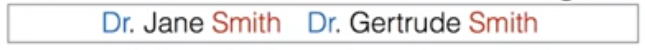
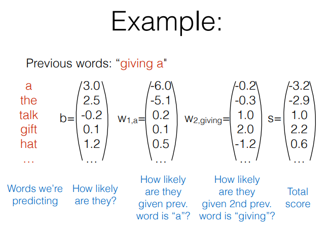
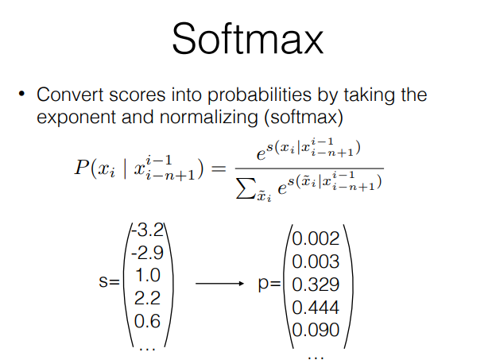

# Predicting the next word in a sentence
> 한 문장에서, 다음에 오는 단어를 어떻게 예측할까?

> 잘못된 단어가 오면 loss를 크게 하고, 적절한 단어가 오면 loss를 작게 하는 방식으로 업데이트(학습) 시킨다면 가능하지 않을까?

#

### 어떻게 해야 할까?

#

### ex) "나는 영화관에서 영화를 __ " 과 같은 문장(n-gram)이 주어졌다고 하자.

> 앞에서 "나는 영화관에서 영화를" 이라는 n-1개의 단어 조합이 등장했을 때, 다음에 등장할(n번째) 확률이 가장 높은 단어(봤다)를 선택하면 되지 않을까?

#### 어떤 단어가 가장 등장할 확률이 높을까?

#### 위 질문에 대답하기 위해 language model에 대해 짚고 넘어가자.

## 1. Count-based Language Models
> 빈도수 기반의 language model   

> 내가 만약 100만개의 문장(데이터)을 가지고 있다고 가정해보자.

> 내가 가진 데이터에서, "나는 영화관에서 영화를 " 이라는 문장이 100번 등장했는데, 그 뒤에 등장한 단어들을 살펴보니,
>각각 '봤다'가 80번, '본다'가 19번, '먹다'가 1번 등장했다.

> #### 추론 : 내가 가진 데이터에서 추론해봤을 때, "내가 영화관에서 영화를" 다음에는 '봤다'라는 단어가 오는게 가장 적절할 것 같아!

#

### 잘 추론했는지 평가하기 위한 지표로 무엇을 사용할까?

## Q. 크로스 엔트로피에서 밑이 2인 로그를 사용하는 이유는?
> 섀넌 엔트로피 : 컴퓨팅에서 밑이 2인 로그를 사용하면 연산량(bite)를 계산할 수 있음.

#

n-gram 모델은 굉장히 좋은 성능을 보여주었고, 오랜 기간 동안 language model의 base-line의 자리를 지키고 있었다.

하지만 완벽한 모델은 아님.

### N-gram 모델의 문제는?
#### 1. 유사단어 등장의 문제
> "나는 영화관에서 영화를 봤다"와 "나는 영화관에서 영화를 본다"는 사실 거의 동일한 문장.
> 하지만, 컴퓨터는 '봤다'와 '본다'가 유사한 의미를 갖는 단어라는걸 모른다. 그냥 단순하게, 등장한 횟수만 계산할 뿐이다.

##### solution : class based language model

#

#### 2. 중간에(intervening) 오는 단어는 추측을 못한다.

> Dr. OOOO Smith이라는 단어는 꽤 빈번하게 등장하는 n-gram이지만, 중간에 오는 단어의 학률은 계산하지 못한다.

##### solution : skip-gram language model (Word2Vec)

#

#### 3. 멀리 떨어져 있는 단어의 관계를 추론하지 못한다.
##### 나는 **프로그래밍** 수업을 위해서 이번에 새로운 ____ "
##### "**테니스** 동아리에 들어간 기념으로, 이번에 새로운  ____ "

> 우리는 첫 번째 문장에는 '**노트북**' 이나 '**컴퓨터**'라는 단어가 등장할 것이라고 유추할 수 있을 것이다.
> 두번째 문장에서는 '**라켓**'이라는 단어가 등장할 것이다.

> 우리가 이렇게 추론할 수 있는 이유는, **'프로그래밍'과 '컴퓨터'**, **'테니스' 와'라켓'** 의 조합이 문맥상에서 주로 함께 등장하는 단어임을 알고 있기 때문이다.

##### soultuin : cache, trigger, topic, syntactic models

#
#

## Altenative : Featurized Log-Linear Models
> 문맥의 features를 계산한다
> feature에 기반하여 확률을 계산한다.
> 경사면하강(Gradient Descent) 알고리즘들을 활용하여, feature의 가중치(weight)를 최적화 한다.

#
#

### Example : Linear neg-log 모델
#### 다음에 올 수 있는 모든 단어들에 대해서 점수를 계산한다.

#### 계산된 점수에 softmax함수를 적용시켜 확률로 만들어준다.

##### softmax함수란?
> 쉽게 생각하면, **수의 집합이 주어졌을 때**, 각각의 점수에 exponential을 취해주고, 전체의 합으로 나눠줌으로써(Normalize) **확률의 형태로 바꿔주는 함수** 이다.

> **출력층에서 제일 큰 값을 갖는 단어가, 가장 큰 확률을 갖는 방식** 이다.
> 가중치(weight)를 업데이트(train) 할 때도, 가장 그럴듯한 단어의 출력값이 가장 큰 값을 갖도록 업데이트가 된다.

> 위의 예시에서는 **giving a** 다음에는 **gift** 라는 단어가 등장할 확률(44.4%)이 가장 높다!!

#

### 간단한 예시

#

### 매번 등장하는 'Lookup'이 도대체 무슨 의미일까?

> a big matrix of word embeddings(개별 단어가 벡터의 형태로 표현된 행렬)에서 특정 단어의 벡터를 가져오는 것.

> 미리 단어들의 벡터(수치)를 정의해두고, 해당 단어가 등장할 때마다, 앞서 만들어둔 table(행렬 : matrix)에서 해당 단어의 벡터(수치)를 가져오는 방법론.

영어 문장을 한글로 번역한다고 할 때, **영단어 사전(embedding matrix)에서 영단어의 뜻(word vector)를 찾는 것으로 비유하면 비슷할 것 같다!**

#
#

## Model 학습
> ML/DL에서 **학습(training)이란**, 사용자가 정의한 loss function(비용 함수: 모델의 오차)을 최소화(minimize) 방식으로 parameter(weight)를 업데이트 하는 것을 의미한다.

> **일반적으로 loss function은 음의 로그우도(negative log likelihood)가 가장 많이 사용된다.**

### negative log likelihood를 쓰는 이유는?
> **log likelihood를 maximize** 하는 방식으로 파라미터를 업데이트 하게 되면, **KL-Divergence(cross-entropy)를 최소화 하는 문제와 본질적으로 동일** 하게 된다.

> **KL-Divergence(cross-entropy)는 data의 분포와 학습시키는 model의 분포 사이의 차이** 라고 볼 수 있다. 즉, model을 우리가 가진 데이터의 실제 분포와 동일하게 만들어가는 작업

#

## Parameter update
> **오류역전파(back-propagation)** 방식으로, loss function(비용 함수)에 대해, 각각의 parameter의 derivative(편미분한 값, 1계 도함수)를 계산하여, 경사면하강(Gradient Descent) 알고리즘으로 parameter를 업데이트 한다.

#

## Evaluation and Vocabulary
> **※중요** 평가하는 모델에 학습된 단어들이 모두 동일해야 한다. 정확히 말하면, 모든 모델이 test set를 생성(generate)할 수 있어야 한다.

#
#

## N-gram의 문제가 해결되었을까?
#### 1. 유사단어 문제
> 아직 해결하지 못함.. ㅠㅠ

#### 2. 중간에 등장하는 단어
> 해결됨!

#### 3. 멀리 떨어진 단어의 관계
> 아직 해결하지 못함.. ㅠㅠ

#

## 선형(linear) 모델은 Feature Combination을 학습하지 못한다.
> xor 문제를 풀 수 없음!

> 모든 feature combination의 vector를 모두 기억할 수 없다.
#
#

## 더 나아가 보자 (non-linear model : Neural language models)

> lookup은 pre-train된 embedding table을 사용한다.
> **embedding** 은 두 단어가 유사하면, 두 단어는 각각 유사한 n차원 벡터로 표현되는 방법론.

> **tanh** : input의 features를 결합하여 하나의 노드 or 소수의 노드로 변형된 출력값(output)을 준다. (비선형성(non-linearlity)을 얻는다)
