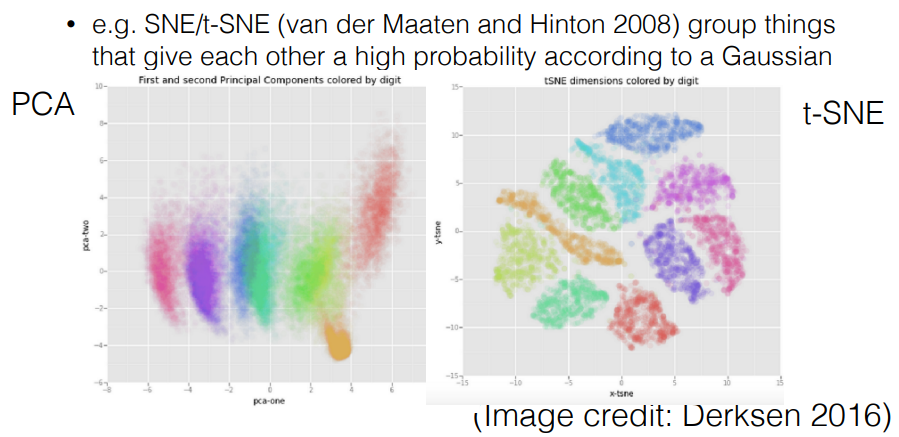
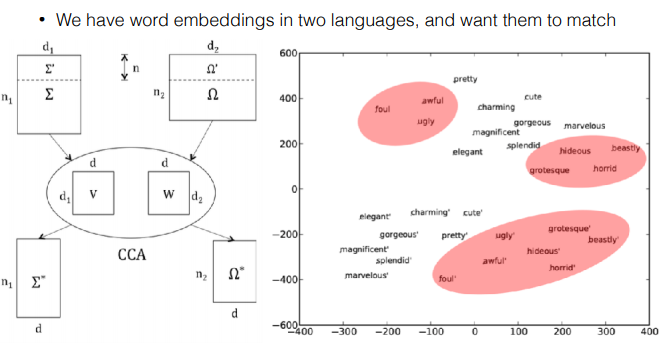
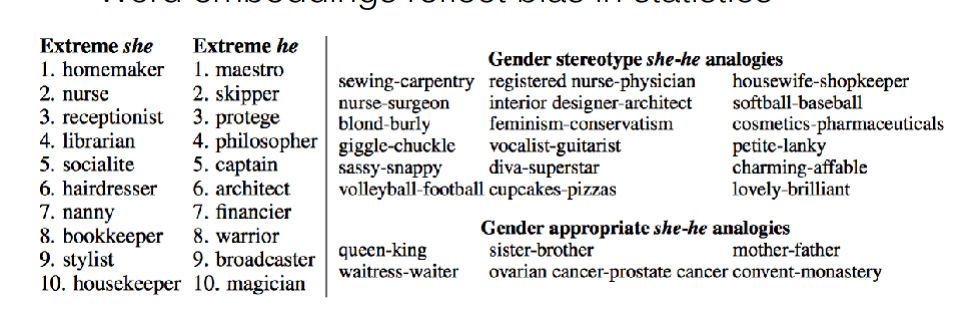

# Models of Words

#

## 우리는 단어에 대해 무엇을 알고 싶을까?
- 품사가 무엇인가? (명사, 동사, 형용사, 조사..)
- 두 단어는 유사한 의미를 가지고 있는가? ('먹다', '먹었다')

## Word net (is-a relationship)

- 모든 단어에 대해, 조건을 정의해야하는 rule-based
- 구축하기 위해 굉장한 시간과 비용이 소모됨

#

## 해답(?) : Word Embedding
> 단어를 하나의 dense한 벡터로 표현하는 방법론

> word embedding의 장점 : 단어의 의미론적 관계를 학습하는게 가능해진다.

## Embedding은 어떻게 학습시킬까?
> initialize randomly : 최초의 embedding matrix는 무작위로 생성
> 후에, supervised or unsupervised learning을 실시

#

## Distributional vs Distributed Representation
> 두 단어는 유사하지만, 전혀 다른 의미를 가지고 있다.

> **Distributional** : '두 단어가 동일한 문맥에서 함께 등장하면 두 단어는 유사한 단어이다' 라는 가정

> **Distributed** : 단어를 하나의 벡터로 표현하는 방법론

#
#

## 그럼 어떻게 단어를 벡터로 표현할까? (Distributed Representation)

## 1. Count-based Method
- 동일한 문맥에서 단어들의 동시등장(Co-occurance) 횟수를 세는 방식 (행은 단어, 열은 문맥)
- 단어의 수가 늘어날수록 차원이 커짐
- 코사인 유사도(Cosine Similarity)를 기반으로 단어간의 유사도를 측정함
#

## 2. Prediction-based Methods
> 널리 알려진 **Word2Vec** (CBOW, Skip-gram)의 방법론이 여기에 해당
> **CBOW** : 한 문맥 안에서, 주변 단어들이 등장했을 때, 중심단어가 등장할 조건부 확률을 높이는 방식으로 학습
> **Skip-gram** : 한 문맥 안에서, 중심 단어가 등장했을 때, 주변 단어가 등장할 확률을 높이는 방식으로 학습

### Q. 왜 CBOW에서는 단어의 embedding을 합(sum)하는 방식으로 학습하는가?
> 만약 다음에 어떤 단어가 오는지 예측하고자 한다면, 해당 단어 바로 다음에 무슨 단어가 오는지, 그 다음에는 어떤 단어가 오는지 **Sequence** 를 중요하게 학습할 필요가 있다. 따라서 concatenate 하는 방식이 더 적절할 수도 있다.

> 하지만, embedding에서는 윈도우(Window)내에서 단어의 동시등장(Co-occurance)만 고려하기 때문에, 단어들이 문맥의 어디에 등장했는지는 고려하지 않는다.

## Skip-gram
> 중심 단어가 주어졌을 때, 문맥(주변 단어)을 예측하도록 학습하는 방법론

#### GloVe 등등..

#
#

## What Contexts?
> 문맥의 크기(window size)를 어떻게 설정해야 할까?
> 작은 문맥(window) : 좀 더 문법, 구조(syntax)적인 embedding
> 큰 문맥(window) : 보다 의미론적(semantic)인 embedding

작은 n-gram은 syntax, 큰 n-gram은 semantic을 잘 학습한다

#

## 임베딩 평가(Evaluation)

- #### Intrinsic vs Extrinsic
  - Intrinsic : 본질적인 feature가 적절한가?
  - Extrinsic : 실제로 얼마나 유용한가?

- #### Qualitatve vs Quantitative
   - Qualitative : 결과물을 직접 눈으로 확인한다.
   - Quantitative : 통계치를 확인한다.

#

## 임베딩의 시각화
  -  Embedding 차원을 2D로 축소하여 시각화 한다.

## 임베딩의 한계
> 사소한 단어의 차이에도 민감하게 반응 (dog/dogs)

> 문맥 상에서 한 단어가 다른 의미를 가질 때, 이를 구분하지 못한다.
(**배** 를 너무 많이 먹어서 **배** 가 부르다.)

> 단어의 위치와 동시등장을 기반으로 학습하기 때문에, **한 단어는 동의어는 물론, 반의어와도 높은 유사도를 갖는다.** (ex: '예쁘다'와 '아름답다'도 유사하지만, '예쁘다'와 '이상하다'도 유사한 단어로 학습)

> Not interpretable : 한 단어가 100차원에 embedding 되었다고 한다면, 각 차원(feature)은 특별한 의미를 갖지 않는다. (ex: PCA를 적용해도 특징을 추출할 수 없음)

#

## Sub-word Embedding
> 형태소 분석에 사용될 수 있는 sub-word Embedding 방법론

#

## Multi-prototype Embedding
> 한 단어가 갖는 여러가지 의미를 분해하는 방법론
> multiple embedding for a Word

#

## Multilingual Coordination of Embeddings
> pre-train된 두 언어의 embedding matrix를 사용하여, translation matrix를 사용하여, 두 언어의 같은 단어를 매칭 시키는 방법

#

## Sparse Embeddings
> embedding에서 각 차원은 아무런 의미가 없다. 해석이 불가능하다

> Solution : sparsity constraint를 추가하여, 개별 단어의 non-zero(dense) 차원의 정보를 증가시킨다.

#

## De-biasing Word Embedding
> Embedding의 편의(bias)를 제거하는 방법론
> 대표적으로 Gender-bias가 존재

