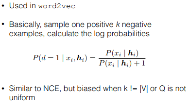
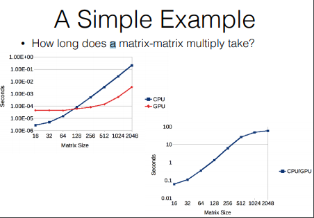
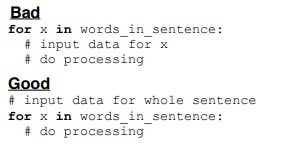

# Why is Word2Vec so fast? : Efficiency Tricks

## 왜 신경망은 느릴까? 어떻게 하면 빠르게 할 수 있을까?

> 1. 연산량이 많다. 특히 큰 corpus에 대한 Softmax 연산이 매우 느림
--> GPU를 사용하자

> 2. GPU는 한번에 큰 연산을 잘 처리한다. 작은 연산을 여러번 처리하는 것보다 훨씬..
--> 연산을 쪼개지 말고, 합쳐서 큰 연산을 만들자

> 3. 데이터가 너무 많아서, 처리할 일이 많다
--> 병렬 처리를 적용하자.

#

### Softmax는 연산량이 너무 많다.

### 분모(denominator)에서 모든 단어에 대한 확률을 계산해야 하기 때문..
> 연산량을 줄이기 위해서는 분모를 계산하는데 필요한 연산량을 줄여야 한다.

### 1. Importance Sampling

### 2. Noise Contrastive Estimation

# 3. **Negative Sampling**

### 4. Mini-batching Negative Sampling
> 매 학습마다, 새로운 Negative Sample에 대한 연산을 하는건 비효율적이다.

> 매 학습마다, 동일한 Negative sample을 사용한다.

#

## Structure-based Softmax Approximations

### 1. Class-based Softmax
> 1. 단어의 class(k개)를 지정한다
> 2. 해당 class 내에서 단어에 대한 확률을 계산한다.

### 2. Hierarchical Softmax
> binary 의사결정을 내리는 tree 구조를 만들어서, 단어를 예측하는 방법론.

### 3. Binary Code Prediction
> 출력 벡터(score)에 softmax 함수를 적용하는 것이 아니라, 출력 벡터(score)의 개별 값에 sigmoid 함수를 적용하여서, binary decision(0 or 1)을 내린다.

> 출력 벡터가 N차원이면, N개의 값에 sigmoid를 통과시켜서 최종적으로 하나의 숫자(단어)를 만들어 낸다.

#

## CPU vs GPU?
> CPU는 fast serial-computation
> GPU는 대부분의 트랜스지터를 병렬처리에 할당하여 병렬처리가 뛰어남

## 병렬처리의 종류

#### Within-operation Parallelism
> 한 종류의 연산 안에서, 작업을 분할하여 할당해주는 병렬처리 방식

#

#### Operation-wise Parallelism
> 전체 데이터에 대해서, 연산을 분할하여 할당해주는 병렬처리 방식

#### Example-wise Parallelism
> 전체 데이터를 K개로 분할하여서, 각각에 연산을 적용하는 방식.

#
#

## GPU 학습 팁

#

#### 1. 연산을 반복하지 말아CMU Neural Nets for NLP 2017 (5): Convolutional Networks for Text라

#### 2. 하나의 큰 연산으로 합쳐라

#### 3. CPU-GPU 메모리 이동을 줄여라

## 메모리를 어떻게 관리할까?
> 1. 대부분의 GPU는 최대 12GB의 메모리를 가지고 있다. 메모리는 중요한 문제이다.

> 2. 불필요한 연산을 최대한 줄여야 한다.

> 3. 꼭 필요하다면, 복수 개의 GPU를 사용하라. (하지만 메모리 이동을 최소화 해야한다.)
