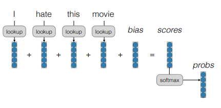
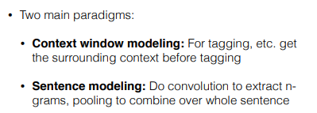

# CNN for Text

## 간단한 예시 (분류 :Classification)
> 아래의 두 문장을 알맞은 감정 상태로 분류해보자

#### 어떻게 해야 할까?

## 1. Bag of Words (BOW)
> 가장 간단한 bag of word 모델을 사용하면

> 단어의 순서나, 단어 간의 결합을 고려하기 어렵다. (ex : don't love (???))

## 2. Continuous Bag of Words (CBOW)
> 가중치-행렬(weight-matrix)을 학습한다. 단어의 의미의 유사성을 일부 학습할 수 있다.

#### Deep CBOW
> tanh 함수를 적용하여, 비선형성(non-linearity)을 획득함으로써, feature combination를 잡아낼 수 있다. ('not' and 'hate')

> 하지만 not hate의 의미를 잡아내기는 어렵다

#

## Bag of n-grams
> 한 단어(unigram) 뿐만 아니라, 두 단어,세 단어(bigram, trigram)의 조합을 벡터로 표현.

> 단어의 조합의 의미를 학습하는게 가능하다. ('not the best', '싫지 않아', '좋다가 말았네')

## Bag or n-grams의 문제점?
> 1. parameter explosion : 모든 단어, 모든 n-gram에 대해, 벡터를 계산해야 한다.

> 2. 유사한 단어나 n-gram의 정보가 공유되지 않는다.
(ex : '좋지 않아'와 '좋다가 말았네'의 유사도를 알 수 없다)

> 3. 새롭게 등장한 단어나, n-gram에 대해 연산이 불가능하다.

#
## Time Delay Neural Networks
> 두 단어의 벡터를 묶어서 tanh 함수를 적용하는 방식으로 feature combination을 학습한다.

> n-gram에 대한 embedding을 모두 가지고 있을 필요 없이, 개별 단어의 embedding만 가지고도 n-gram 학습이 가능하다는 장점

#

## Convolutional Neural Network (CNN)
> 원래는 이미지 처리에서 사용되던 신경망

> Convolution 과정과 Pooling 과정으로 구성되어 있으며, 특징을 찾아내는 성능이 매우 뛰어남 (Feature Extraction)

## CNN for Tagging (Collobert and Weston 2011)
> Context window modeling
> 주변(context) 단어를 살펴보고, 목표 단어('on')의 tag를 예측한다. (skip-gram과 유사)

## CNN for Sentence Modeling

#

## Standard Standard conv2d Function
> 2D 컨볼루션 함수는 input과 paramter가 필요

#### Input and Parameters
- **input** : 3D tensor
  - rows(e.g. words), columns(embedding), features('channel')

- **Parameters/Filters** : 4D tensor
  - rows, columns, input features, output features

#### Padding
> 컨볼루션을 하고 나면, output tensor의 row나 column의 크기가 줄어들거나(narrow), 유지되거나(same), 늘어남(wide)

#### Pooling
> Convolution의 결과에 적용하는 reduction function
> CNN에서는 특정 feature를 찾아내기 위해 Max-pooling 방식이 주로 사용됨

- **Max pooling** : 한 개의 특정한 feature를 찾을 때 (가장 큰 값 하나. most common)
- **Average pooling** : 전체 범위에 적용되는 feature를 찾아낼 때, (speech에서 남자와 여자의 성별을 구분할 때 유용)
- **k-Max pooling** : 특정 feature를 k개 까지 찾아냄
- **Dynamic pooling** : 특정 feature가 처음에/중간에/마지막에 등장했는지 찾아냄
#

## CNN for Sentence Classification (Yoon Kim, 2014)

## Advanced CNN

#

## 비선형 함수 (Nonlinear Function)

# 왜 문장을 모델링 하기위해 CNN을 사용할까?
> RNN에 대비해서
> 1. Input에서 Output까지의 연산 과정이 단순하다.
> 2. GPU에서 병렬처리 하기 쉽다.
> 3. 모든 문장의 길이를 동일하게 맞춰야 하기 때문에, 문장별로 단어 수가 많이 차이날 경우, 효과가 떨어진다.

# 페어 문장 모델 ??
- 검색, 문장 간의 유사도 측정

- Pairphrase Recognition
> 동일한 모델에 다른 input을 투입한다.
> output이 유사하면 두 input은 페어이고, output이 유사하지 않으면 두 input은 페어가 아니다.
#

> 서로 다른 두 문서에서 각각 문장들을 순차적으로 추출하여 matrix(2D)를 만든다.
> 만들어진 2D tensor에 Convolution을 적용하여, 문장들 간의 유사도를 측정한다.

## 왜 모델을 알아야 하는가?
> 모델에 존재하는 편의(bias)를 확인할 수 있다.
> extracted feature를 이해함으로써 새로운 아키텍처에 대한 아이디어를 얻을 수 있다.
> filter들에 대한 시각화가 가능하다

> 컴퓨터 비전(CV) 분야에서는 굉장히 발달해 있으나, 자연어 처리(NLP)에서는 아직 덜 발달되어 있다.

## Occlusion
> 이미지 처리에서 사용되는 방법론
> 특정 영역을 제거했을 때, 결과 값에서 얼마나 차이를 보이는지 확인
> 강아지 사진에서 강아지의 얼굴을 가리면 결과 값이 큰 차이를 보임 (파랗게 표시됨)

> **NLP에서 동일하게 적용해보면?**
> 특정 단어의 벡터를 영벡터로 치환하였을 때, 결과 값에서 가장 큰 차이를 보이는 단어가 핵심 단어가 될 수 있지 않을까?
