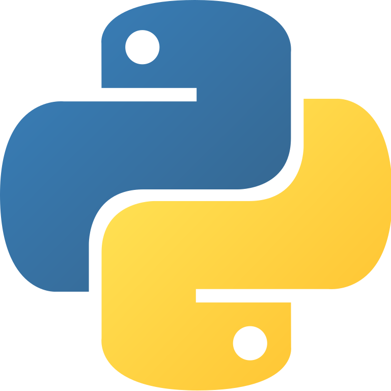

# Today I learned
this repository is where I write code implementations of what I've learned everyday.

&nbsp;

# Rust
  

&nbsp;

## The Programming Language Rust

- [`Chapter 01`: Hello Cargo](https://github.com/BlueWhaleKo/til/tree/master/rust/the-programming-language-rust/ch01_hello_cargo/src/main.rs)
- [`Chapter 02`: Guessing Game](https://github.com/BlueWhaleKo/til/tree/master/rust/the-programming-language-rust/ch02_guessing_game/src/main.rs)
- [`Chapter 03`: Functions](https://github.com/BlueWhaleKo/til/tree/master/rust/the-programming-language-rust/ch03_functions/src/main.rs)
- [`Chapter 04`: Ownership](https://github.com/BlueWhaleKo/til/tree/master/rust/the-programming-language-rust/ch04_ownership/src/main.rs)
- [`Chapter 05`: Structure](https://github.com/BlueWhaleKo/til/tree/master/rust/the-programming-language-rust/ch05_structure/src/main.rs)
- [`Chapter 06`: Enum](https://github.com/BlueWhaleKo/til/tree/master/rust/the-programming-language-rust/ch06_enum/src/main.rs)
- [`Chapter 07`: Module](https://github.com/BlueWhaleKo/til/tree/master/rust/the-programming-language-rust/ch07_module/src)
- [`Chapter 08`: Collections](https://github.com/BlueWhaleKo/til/tree/master/rust/the-programming-language-rust/ch08_collections/src)
- [`Chapter 09`: Errors](https://github.com/BlueWhaleKo/til/tree/master/rust/the-programming-language-rust/ch09_errors/src)
- [`Chapter 10`: Generic Types](https://github.com/BlueWhaleKo/til/tree/master/rust/the-programming-language-rust/ch10_generic_types/src)
- [`Chapter 11`: Test](https://github.com/BlueWhaleKo/til/tree/master/rust/the-programming-language-rust/ch11_test)
- [`Chapter 12`: I/O Project](https://github.com/BlueWhaleKo/til/tree/master/rust/the-programming-language-rust/ch12_io_project)
- [`Chapter 13`: Iterator and Closure](https://github.com/BlueWhaleKo/til/tree/master/rust/the-programming-language-rust/ch13_iterator_and_closure)
- [`Chapter 14`: Cargo and Crates I/O](https://github.com/BlueWhaleKo/til/tree/master/rust/the-programming-language-rust/ch14_cargo_and_crates_io)
- [`Chapter 15`: Smart Pointers](https://github.com/BlueWhaleKo/til/tree/master/rust/the-programming-language-rust/ch15_smart_pointer)
- [`Chapter 16`: Concurrency](https://github.com/BlueWhaleKo/til/tree/master/rust/the-programming-language-rust/ch16_concurrency)
- [`Chapter 17`: OOP](https://github.com/BlueWhaleKo/til/tree/master/rust/the-programming-language-rust/ch17_OOP/src/main.rs)
- [`Chapter 18`: Patterns](https://github.com/BlueWhaleKo/til/tree/master/rust/the-programming-language-rust/ch18_patterns/src/lib.rs)
- [`Chapter 19`: Advanced](https://github.com/BlueWhaleKo/til/blob/master/rust/the-programming-language-rust/ch19_advanced/src/lib.rs)
- [`Chapter 20`: Http Project](https://github.com/BlueWhaleKo/til/tree/master/rust/the-programming-language-rust/ch20_http_project/src)

## Data Structures Implementations
- [`Item 01`: Vec<T> (Heap-allocated Array)](https://github.com/BlueWhaleKo/til/tree/master/rust/data-structures/vec/src)
- [`Item 02`: Linked List](https://github.com/BlueWhaleKo/til/blob/master/rust/data-structures/linked_list/src/single_linked_list.rs)
- [`Item 03`: Hash Table](https://github.com/BlueWhaleKo/til/tree/master/rust/data-structures/hashtable/src/lib.rs)
- [`Item 04`: Binary Search Tree](https://github.com/BlueWhaleKo/til/tree/master/rust/data-structures/btree/src/lib.rs)
- [`Item 05`: Trie](https://github.com/BlueWhaleKo/til/tree/master/rust/data-structures/trie/src/lib.rs)

## Crust of Rust

- [`Item 01`: Iterator](https://github.com/BlueWhaleKo/til/blob/master/rust/crust-or-rust/iterator/src/main.rs)

## Leetcode
- [`No.121`: Best Time to Buy and Sell Stock](https://github.com/BlueWhaleKo/til/blob/master/rust/leetcode/no121_Best_Time_To_Buy_And_Sell_Stock/src/lib.rs)
- [`No.136`: Single Number](https://github.com/BlueWhaleKo/til/blob/master/rust/leetcode/no136_Single_Number/src/lib.rs)
- [`No.169`: Majority Element](https://github.com/BlueWhaleKo/til/blob/master/rust/leetcode/no169_Majority_Element/src/lib.rs)
- [`No.283`: Move Zeroes](https://github.com/BlueWhaleKo/til/blob/master/rust/leetcode/no283_Move_Zeroes/src/lib.rs)
- [`No.448`: Find All Numbers Disappeared in an Array](https://github.com/BlueWhaleKo/til/tree/master/rust/leetcode/no448_Find_All_Numbers_Disappeared_In_An_Array)

&nbsp;
# Golang

&nbsp;

## A tour or Go

- [`Chapter 01`: Hello Go](https://github.com/BlueWhaleKo/til/tree/master/go/a-tour-of-go/01_hello/main.go)
- [`Chapter 02`: Package](https://github.com/BlueWhaleKo/til/tree/master/go/a-tour-of-go/02_package/main.go)
- [`Chapter 03`: Iterations and Conditions](https://github.com/BlueWhaleKo/til/tree/master/go/a-tour-of-go/03_iteration_and_condition/main.go)
- [`Chapter 04`: Data Structures](https://github.com/BlueWhaleKo/til/tree/master/go/a-tour-of-go/04_data_structures/main.go)

&nbsp;
# Java
  

&nbsp;

## Java201
This repository is my personal records of studying intermediate-level java concepts
### Contents

- [`Item 01`: Generics class and generic methods](https://github.com/BlueWhaleKo/til/blob/master/java/java201/src/Generic.java)
- [`Item 02`: Immutable Objects](https://github.com/BlueWhaleKo/til/blob/master/java/java201/src/ImmutableObject.java)
- [`Item 03`: Weak Reference](https://github.com/BlueWhaleKo/til/blob/master/java/java201/src/WeakReferences.java)
- [`Item 04`: Reflection](https://github.com/BlueWhaleKo/til/blob/master/java/java201/src/Reflection.java)
- [`Item 05`: Thread](https://github.com/BlueWhaleKo/til/blob/master/java/java201/src/Threading.java)

&nbsp;
## Effective Java 3rd

This repository is where I write code implementations of Effective Jave 3rd edition 
### Contents

- [`Item 01`: Consider static factory methods instead of constructors](https://github.com/BlueWhaleKo/til/blob/master/java/effective_java/src/Item01.java)
- [`Item 02`: Consider a builder when faced with many constructor parameters](https://github.com/BlueWhaleKo/til/blob/master/java/effective_java/src/Item02.java)
- [`Item 03`: Enforce the singleton property with a private constructor or an enum type](https://github.com/BlueWhaleKo/til/blob/master/java/effective_java/src/Item03.java)
- [`Item 04`: Enforce noninstantiability with a private constructor](https://github.com/BlueWhaleKo/til/blob/master/java/effective_java/src/Item04.java)
- [`Item 05`: Prefer dependency injection to hardwiring resources](https://github.com/BlueWhaleKo/til/blob/master/java/effective_java/src/Item05.java)
- [`Item 06`: Avoid creating unnecessary objects](https://github.com/BlueWhaleKo/til/blob/master/java/effective_java/src/Item06.java)
- [`Item 07`: Eliminate obsolete object references](https://github.com/BlueWhaleKo/til/blob/master/java/effective_java/src/Item07.java)
- [`Item 08`: Avoid finalizers and cleaners](https://github.com/BlueWhaleKo/til/blob/master/java/effective_java/src/Item08.java)
- [`Item 09`: Prefer try-with-resource to try-finally](https://github.com/BlueWhaleKo/til/blob/master/java/effective_java/src/Item09.java)
- [`Item 10`: Obey the general contract with overriding equals](https://github.com/BlueWhaleKo/til/blob/master/java/effective_java/src/Item10.java)
- [`Item 11`: Always override hashCode when you override equals](https://github.com/BlueWhaleKo/til/blob/master/java/effective_java/src/Item11.java)
- [`Item 12`: Always override toString](https://github.com/BlueWhaleKo/til/blob/master/java/effective_java/src/Item12.java)
- [`Item 13`: Override clone judiciously](https://github.com/BlueWhaleKo/til/blob/master/java/effective_java/src/Item13.java)
- [`Item 14`: Consider implementing Comparable](https://github.com/BlueWhaleKo/til/blob/master/java/effective_java/src/Item14.java)

&nbsp;

## Data Structure and Algorithms

This repository is where I write code implementations of Effective Jave 3rd edition 
### Contents
- [`Binary Search Tree`: Traverse nodes in level-order](https://github.com/BlueWhaleKo/til/blob/master/java/data_structure_and_algorithm/src/BinarySearchTree.java)
- [`Graph`: DFS and BFS](https://github.com/BlueWhaleKo/til/blob/master/java/data_structure_and_algorithm/src/Graph.java)
- [`Graph`: Check if two nodes are connected](https://github.com/BlueWhaleKo/til/blob/master/java/data_structure_and_algorithm/src/GraphConnectionCheck.java)

&nbsp;

&nbsp;
# Spring
  

## Spring101
### Contents

- [`ToyProject`: Hello Spring!](https://github.com/BlueWhaleKo/til/tree/master/java/spring101/hello-spring)
- [`ToyProject`: Book Store](https://github.com/BlueWhaleKo/til/tree/master/java/spring101/jpashop)
- [`IoC`: Dependency Injection and IoC](https://velog.io/@koo8624/Spring101-%EC%9D%98%EC%A1%B4%EC%84%B1-%EC%A3%BC%EC%9E%85Dependency-Injection)
- [`AOP`: Aspect Oriented Programming](https://velog.io/@koo8624/Spring101-%EA%B4%80%EC%A0%90-%EC%A7%80%ED%96%A5-%ED%94%84%EB%A1%9C%EA%B7%B8%EB%9E%98%EB%B0%8DAOP)
- [`Test`: Test With @SpringBootTest](https://velog.io/@koo8624/Spring-%EC%8A%A4%ED%94%84%EB%A7%81-%EB%B6%80%ED%8A%B8%EC%97%90%EC%84%9C-%ED%86%B5%ED%95%A9-%ED%85%8C%EC%8A%A4%ED%8A%B8-%EC%8B%A4%ED%96%89%ED%95%98%EA%B8%B0)
- [`JPA`: Entity, PersistencyContext and EntityManager](https://velog.io/@koo8624/Spring-EntityManager)
- [`JPA`: Entity Architecture Tips](https://velog.io/@koo8624/Spring-Entity-%EC%84%A4%EA%B3%84-%EC%8B%9C-%EC%A3%BC%EC%9D%98%EC%82%AC%ED%95%AD)
- [`JPA`: Update Entity With Dirty Check](https://velog.io/@koo8624/Spring-%EB%B3%80%EA%B2%BD-%EA%B0%90%EC%A7%80%EB%A5%BC-%ED%99%9C%EC%9A%A9%ED%95%9C-Entity-%EC%88%98%EC%A0%95)
- [`JPA`: Lazy Fetch and JPA Query Optimization](https://velog.io/@koo8624/Spring-JPA-%EC%84%B1%EB%8A%A5-%EC%B5%9C%EC%A0%81%ED%99%94#fetch-join)
- [`JPA`: @CreationTimeStamp, @UpdateTimeStamp](https://velog.io/@koo8624/Spring-CreationTimestamp-UpdateTimestamp)
- [`Spring`: Create Custom Validation with @Constraint](https://velog.io/@koo8624/Spring-Constraint%EB%A1%9C-%EC%BB%A4%EC%8A%A4%ED%85%80-validation-%EB%A7%8C%EB%93%A4%EA%B8%B0)

&nbsp;

# Python
  

&nbsp;
## Design Patterns

- [`Item 01`: Singleton](https://github.com/BlueWhaleKo/til/blob/master/python/design_patterns/01.singltone.py)
- [`Item 02`: Factory](https://github.com/BlueWhaleKo/til/blob/master/python/design_patterns/02.factory.py)
- [`Item 03`: Builder](https://github.com/BlueWhaleKo/til/blob/master/python/design_patterns/03.builder.py)
- [`Item 04`: Abstract Factory](https://github.com/BlueWhaleKo/til/blob/master/python/design_patterns/04.abstract_factory.py)
- [`Item 05`: Adapter](https://github.com/BlueWhaleKo/til/blob/master/python/design_patterns/05.adapter.py)
- [`Item 06`: Composite](https://github.com/BlueWhaleKo/til/blob/master/python/design_patterns/06.composite.py)
- [`Item 07`: Command](https://github.com/BlueWhaleKo/til/blob/master/python/design_patterns/07.command.py)
- [`Item 08`: Observer](https://github.com/BlueWhaleKo/til/blob/master/python/design_patterns/08.observer.py)
- [`Item 09`: Bridge](https://github.com/BlueWhaleKo/til/blob/master/python/design_patterns/09.bridge.py)
- [`Item 10`: Strategy](https://github.com/BlueWhaleKo/til/blob/master/python/design_patterns/10.strategy.py)
- [`Item 11`: State](https://github.com/BlueWhaleKo/til/blob/master/python/design_patterns/11.state.py)
- [`Item 12`: Proxy](https://github.com/BlueWhaleKo/til/blob/master/python/design_patterns/12.proxy.py)
- [`Item 13`: Mixin](https://github.com/BlueWhaleKo/til/blob/master/python/design_patterns/13.mixin.py)

&nbsp;
## Django
- [`Item 01`: Toy web server](https://github.com/BlueWhaleKo/til/blob/master/python/django/poll)
- [`Item 02`: Simple Instagram clone coding](https://github.com/BlueWhaleKo/til/blob/master/python/django/instagram)
- [`Item 03`: Finance Data Reader API Server](https://github.com/BlueWhaleKo/til/blob/master/python/django/fdr_api)
- [`Item 04`: Kiwoom API Server](https://github.com/BlueWhaleKo/til/blob/master/python/django/kiwoom_rest_api)

&nbsp;
## Algorithms

- [`LeetCode`: (Array101) Check If N and Its Double Exist](https://github.com/BlueWhaleKo/til/blob/master/python/leetcode/Array101/Check%20If%20N%20and%20Its%20Double%20Exist.py)
- [`LeetCode`: (Array101) Duplicated Zeros](https://github.com/BlueWhaleKo/til/blob/master/python/leetcode/Array101/Check%20If%20N%20and%20Its%20Double%20Exist.py)
- [`LeetCode`: (Array101) Find Numbers with Even Number of Digits](https://github.com/BlueWhaleKo/til/blob/master/python/leetcode/Array101/Find%20Numbers%20with%20Even%20Number%20of%20Digits.py)
- [`LeetCode`: (Array101) Max Consecutive Ones](https://github.com/BlueWhaleKo/til/blob/master/python/leetcode/Array101/Max%20Consecutive%20Ones.py)
- [`LeetCode`: (Array101) Merge Sorted Array](https://github.com/BlueWhaleKo/til/blob/master/python/leetcode/Array101/Merge%20Sorted%20Array.py)
- [`LeetCode`: (Array101) Move Zeroes](https://github.com/BlueWhaleKo/til/blob/master/python/leetcode/Array101/Move%20Zeroes.py)
- [`LeetCode`: (Array101) Remove Duplicates from Sorted Array](https://github.com/BlueWhaleKo/til/blob/master/python/leetcode/Array101/Remove%20Duplicates%20from%20Sorted%20Array.py)
- [`LeetCode`: (Array101) Remove Element Solution](https://github.com/BlueWhaleKo/til/blob/master/python/leetcode/Array101/Remove%20Element%20%20Solution.py)
- [`LeetCode`: (Array101) Remove Elements with Greatest Element on Right Side](https://github.com/BlueWhaleKo/til/blob/master/python/leetcode/Array101/Replace%20Elements%20with%20Greatest%20Element%20on%20Right%20Side.py)
- [`LeetCode`: (Array101) Sort Array By Parity](https://github.com/BlueWhaleKo/til/blob/master/python/leetcode/Array101/Sort%20Array%20By%20Parity.py)
- [`LeetCode`: (Array101) Squares of a Sorted Array](https://github.com/BlueWhaleKo/til/blob/master/python/leetcode/Array101/Squares%20of%20a%20Sorted%20Array.py)
- [`LeetCode`: (Array101) Valid Mountain Array](https://github.com/BlueWhaleKo/til/blob/master/python/leetcode/Array101/Valid%20Mountain%20Array.py)
- [`Programmers`: (BFS/DFS) Target Number](https://github.com/BlueWhaleKo/til/blob/master/python/algorithms/BFS_DFS/target_number.py)
- [`Programmers`: (BFS/DFS) Network](https://github.com/BlueWhaleKo/til/blob/master/python/algorithms/BFS_DFS/network.py)
- [`Programmers`: (BFS/DFS) Word Transformation](https://github.com/BlueWhaleKo/til/blob/master/python/algorithms/BFS_DFS/word_transformation.py)
- [`Programmers`: (Dynamic Programming) Triangle](https://github.com/BlueWhaleKo/til/blob/master/python/algorithms/dynamic_programming/triangle.py)
- [`Programmers`: (Dynamic Programming) Way to School](https://github.com/BlueWhaleKo/til/blob/master/python/algorithms/dynamic_programming/way_to_school.py)
- [`Programmers`: (Greedy) Max Number](https://github.com/BlueWhaleKo/til/blob/master/python/algorithms/greedy/max_number.py)
- [`Programmers`: (Exhaustive Search) Count Prime Numbers](https://github.com/BlueWhaleKo/til/blob/master/python/algorithms/exhaustive_search/count_prime_numbers.py)
- [`Programmers`: (Graph) Farthest Node](https://github.com/BlueWhaleKo/til/blob/master/python/algorithms/graph/farthest_node.py)
- [`Others`: (Sort) Merge Sort](https://github.com/BlueWhaleKo/til/blob/master/python/algorithms/etc/merge_sort.py)

&nbsp;
# Devops

&nbsp;
## AWS

### Contents
- [`Access`: Accessing AWS with IAM](https://velog.io/@koo8624/AWS-%EB%B0%B1%EC%84%9C-AWS-Access)
- [`Computing`: EC2](https://velog.io/@koo8624/AWS-%EB%B0%B1%EC%84%9C-%EC%BB%B4%ED%93%A8%ED%8C%85Computing-EC2)
- [`Computing`: EC2 Container Service(ECS)](https://velog.io/@koo8624/AWS-%EB%B0%B1%EC%84%9C-%EC%BB%B4%ED%93%A8%ED%8C%85Computing-EC2)
- [`Computing`: Lightsail, Batch, Lambda and Elastic Beanstalk](https://velog.io/@koo8624/AWS-%EB%B0%B1%EC%84%9C-Computing-Lightsail-Batch-Beanstalk-Lambda)
- [`Storage`: S3](https://velog.io/@koo8624/AWS-%EB%B0%B1%EC%84%9C-Storage-S3)
- [`Storage`: S3 Glacier Deep Archive](https://velog.io/@koo8624/AWS-%EB%B0%B1%EC%84%9C-S3-Glacier-Deep-Archive)
- [`Storage`: Elastic Block Storage(EBS)](https://velog.io/@koo8624/AWS-%EB%B0%B1%EC%84%9C-Storage-AWS-Elastic-Block-Store)
- [`Storage`: Elastic File System(EFS)](https://velog.io/@koo8624/AWS-%EB%B0%B1%EC%84%9C-AWS-EFS)
- [`Storage`: Storage Gateway](https://velog.io/@koo8624/AWS-%EB%B0%B1%EC%84%9C-Storage-Storage-Gateway)
- [`Network`: VPC: Components](https://velog.io/@koo8624/AWS-%EB%B0%B1%EC%84%9C-Network-VPC-1%ED%8E%B8)
- [`Network`: VPC: Network Interfaces](https://velog.io/@koo8624/AWS-%EB%B0%B1%EC%84%9C-Network-VPC-Network-Interfaces)
- [`Network`: VPC: NAT Devices](https://velog.io/@koo8624/AWS-%EB%B0%B1%EC%84%9C-Network-NAT-Devices)
- [`Network`: Bastion Host](https://velog.io/@koo8624/AWS-%EB%B0%B1%EC%84%9C-Network-Bastion-Host)
- [`Network`: VPC Endpoint](https://velog.io/@koo8624/AWS-%EB%B0%B1%EC%84%9C-Network-VPC-Endpoint)
- [`Network`: Elastic Load Balancing](https://velog.io/@koo8624/AWS-%EB%B0%B1%EC%84%9C-Elastic-Load-Balancing)
- [`Network`: Route53](https://velog.io/@koo8624/AWS-%EB%B0%B1%EC%84%9C-Network-Route53)
- [`Security`: IAM Deep Dive](https://velog.io/@koo8624/AWS-Security-IAM-Deep-Dive)
- [`Security`: API Gateway](https://velog.io/@koo8624/AWS-Network-API-Gateway)

&nbsp;

## Docker & Docker Compose

### Contents
- [`Overview`: Docker Architecture Overview](https://velog.io/@koo8624/Docker-%EB%B2%88%EC%97%AD-%EB%8F%84%EC%BB%A4-%EC%95%84%ED%82%A4%ED%85%8D%EC%B2%98-Docker-Architecture-Overview)
- [`Container`: Docker Container: Under the Hood](https://velog.io/@koo8624/Docker-%EB%8F%84%EC%BB%A4-%EC%BB%A8%ED%85%8C%EC%9D%B4%EB%84%88-Docker-Container-Under-the-Hood)
- [`FileSystem`: Docker File System: Union File System](https://velog.io/@koo8624/Docker-%EC%9C%A0%EB%8B%88%EC%98%A8-%ED%8C%8C%EC%9D%BC-%EC%8B%9C%EC%8A%A4%ED%85%9C-Union-File-System)
- [`Storage Driver`: UFS and Storage Driver](https://velog.io/@koo8624/Docker-%EC%8A%A4%ED%86%A0%EB%A6%AC%EC%A7%80-%EB%93%9C%EB%9D%BC%EC%9D%B4%EB%B2%84-Storage-Driver)
- [`Network`: Docker Network: Under the Hood](https://velog.io/@koo8624/Docker-%EB%8F%84%EC%BB%A4-%EB%84%A4%ED%8A%B8%EC%9B%8C%ED%81%AC-Docker-Network-Under-the-Hood)
- [`Network`: Docker Network Overview](https://velog.io/@koo8624/Docker-%EB%8F%84%EC%BB%A4-%EB%84%A4%ED%8A%B8%EC%9B%8C%ED%81%AC-Docker-Network-Overview)
- [`Network`: Linux Virtual Network Interfaces](https://velog.io/@koo8624/Linux-Linux-Virtual-networking-Interface)
- [`Toy Project`: Build redis image](https://github.com/BlueWhaleKo/til/blob/master/devops/docker/redis-image/Dockerfile)
- [`Toy Project`: Build simple web application](https://github.com/BlueWhaleKo/til/blob/master/devops/docker/simpleweb)
- [`Toy Project`: Deploy toy web application with docker-compose](https://github.com/BlueWhaleKo/til/blob/master/devops/docker/visits-starter)
- [`Toy Project`: Deploy frontend application with docker-compose](https://github.com/BlueWhaleKo/til/blob/master/devops/docker/simpleweb)
- [`Toy Project`: Deploy complex web application with docker-compose](https://github.com/BlueWhaleKo/til/blob/master/devops/docker/complex)

&nbsp;

## k8s

### Contents
- [`Toy Project`: Deploy simple web application](https://github.com/BlueWhaleKo/til/blob/master/devops/k8s/simplek8s)
- [`Architecture`: Kubernetes Architecture Overview](https://velog.io/@koo8624/%EB%B2%88%EC%97%AD-%EC%BF%A0%EB%B2%84%EB%84%A4%ED%8B%B0%EC%8A%A4-%EC%95%84%ED%82%A4%ED%85%8D%EC%B2%98-Kubernetes-Architecture-Explained)
- [`API Server`: Kubernetes API Server](https://velog.io/@koo8624/Kubernetes-%EC%BF%A0%EB%B2%84%EB%84%A4%ED%8B%B0%EC%8A%A4-API-%EC%84%9C%EB%B2%84)
- [`Network`: Understanding Kubernetes Networking](https://velog.io/@koo8624/Kubernetes-%EC%BF%A0%EB%B2%84%EB%84%A4%ED%8B%B0%EC%8A%A4-%EB%84%A4%ED%8A%B8%EC%9B%8C%ED%81%AC-Understanding-kubernetes-networking)
- [`Probe`: Probes in Kubernetes](https://velog.io/@koo8624/Kubernetes-Probes)

&nbsp;

## Terraform

- [`Toy Project`: Create Azure Resources](https://github.com/BlueWhaleKo/til/blob/master/devops/terraform)

&nbsp;

## DataBase and Distributed System

### Contents
- [`Distributed System`: Apache ZooKeeper](https://velog.io/@koo8624/%EB%B6%84%EC%82%B0-%EC%8B%9C%EC%8A%A4%ED%85%9C-Apache-Zookeeper)
- [`Database`: Google Bigtable](https://velog.io/@koo8624/%EB%8D%B0%EC%9D%B4%ED%84%B0%EB%B2%A0%EC%9D%B4%EC%8A%A4-Google-Bigtable)
- [`Database`: Index](https://velog.io/@koo8624/%EB%8D%B0%EC%9D%B4%ED%84%B0%EB%B2%A0%EC%9D%B4%EC%8A%A4-%EC%9D%B8%EB%8D%B1%EC%8A%A4Index)
- [`Elasticsearch`: Architecture](https://velog.io/@koo8624/Database-Elastic-Search-2%ED%8E%B8-%EC%95%84%ED%82%A4%ED%85%8D%EC%B2%98Architecture)
- [`Elasticsearch`: Inverted Index & Morpheme Analysis](https://velog.io/@koo8624/Database-Elastic-Search-2%ED%8E%B8-%EC%95%84%ED%82%A4%ED%85%8D%EC%B2%98Architecture)

