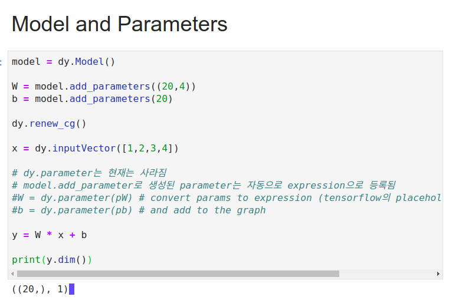

### Why Neural Networks for NLP?
- because language is hard  

#

### Phenomena to Handle
- Morphology
- Syntax
- Semantics/ World Knowledge
- Discourse
- Pragmatics
- Multilinguality

#

## **Sentence Classfication**

+ ### Bag of Words(BOW)
> One-hot encoding
> 처음 보는 단어에 대한 벡터를 추출할 수 없음

+ ### Basic Idea of NN (for NLP Predicion Tasks)
> 복잡한(비선형) 함수를 사용하여 **combination features** 를 추출함

#

### Node
- node는 다음의 값 중 하나에 해당한다. {tensor, matrix, vector, scalar}

- edge와 연결된 node는 해당 edge와 직전에 연결된 node(tail node)의 함수(function) 형태이다.

- node는 임의의 입력값(input) $\cfrac { \partial \digamma  }{ \partial f\left( u \right)  } $ 에 대해 그 자신의 값(value)와 도함수(derivative)를 계산할 수 있다.

### edge
- edge는 함수(function)을 의미하며, node를 가리키는 pointer.

#

### **node와 edge의 결합으로 다양한 함수를 표현할 수 있다**

#

#

## **Algotithms**

+ ### **Forward propagation**
> 입력받은 변수(input)에서 연결된 노드로 순서대로 연산(edge)을 수행

#

+ ## **Back propagation**
> Forward-propagation의 역순으로 연산을 수행
> 최종 출력값(final value: output)에 대한 파라미터의 도함수(derivatives)를 계산하는 방식.
> final value는 주로 loss function으로 사용한다 (minimize)

- **parameter update**
> move the parameters in the direction of this derivative (Gradient Descent)

$W\quad -=\quad \alpha \quad \quad \cfrac { dl }{ dW }$

#

#

## Basic Process in Dynamic Neural Netword Frameworks

- 1. 모델 생성 (Create a model)
- 2. For each example
  + 본인이 원하는 연산을 수행할 그래프(graph)를 생성
  + 연산의 결과를 계산 (calculate the result of that computation)
  + 오류 역전파(back-propagation) and 파라미터 업데이트(update)

#

#

## Model and Parameters
- Parameters : things we optimize(train) over (vector, matrices)

- Model : collection of Parameters

- Parameters out-live the computation graph

#

#

## Training with Dynet

- 1. 모델, 파라미터, trainer를 생성
- 2. 매 training epoch 마다
  + cost(loss)를 계산하기 위한 graph를 생성
  + run forward : cost(loss)를 계산
  + run backward : gradient를 계산
  + update : gradient가 감소하는 방향으로 parameter 업데이트

## Bag of Words (BOW)

- 모든 단어는 개별 벡터를 갖는다.

- 단어의 개별 벡터와 bias를 더하여, 문장을 수치화한다.

- softmax 함수를 적용하여, 특정 class에 포함될 확률을 계산한다.

## Continuous Bag of Words (CBOW)

- 모든 개별 단어(벡터)는 'features'를 가지고 있다.

- 개별 벡터(features)의 합을 계산한 뒤, **Weight matrix를 곱하는 방식(선형 결합)** 으로 수치화 시킨다.

- 이런 방식은, 선형모델(linear-model)을 사용하기 때문에, **비선형적(non-linear) 패턴(특징)을 찾아내기 어렵다.**

#

### 비선형(non-linear)함수를 사용한 결합

- feature의 비선형적 결합의 결과물을 얻을 수 있음.

- '싫지','않아'와 같은 단어를 capture할 수 있음

#

## Things to Remeber

- 뉴럴넷은 강력하다!
- universal function approximators : 비선형적인 함수의 형태도 잘 잡아낼(capture) 수 있다.

- 하지만 자연어는 어렵고, 데이터의 수는 한정되있다(limited).

- 적절한 모델을 설계하는 방법과, 뉴럴넷의 세부적인 디테일을 배운다!
